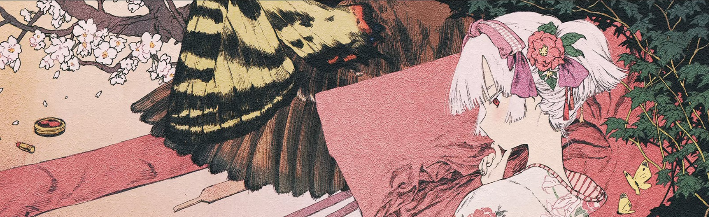
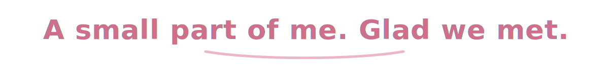

  

  

  <em>BUPT CS Student · Exploring software, systems &amp; hardware</em>

  
  

---

## About Me

- Computer Science sophomore at Beijing University of Posts and Telecommunications
- Exploring software, systems, and hardware while documenting what I learn along the way
- I hope to become capable, remarkable, and true to the person I want to be

---

## Contact

- School: [wangnai@bupt.edu.cn](mailto:wangnai@bupt.edu.cn)
- Personal: [ragingbulls7468@gmail.com](mailto:ragingbulls7468@gmail.com)

---

## Tech Stack

  
  
  
  
  

---

## Featured Projects

#### [BUPT-ComputerNetwork-Lab1](https://github.com/Makinuohara/BUPT-ComputerNetwork-Lab1) · `C`

> A computer networks course project for understanding protocols and communication through practice.

#### [formal-languages-and-automata-lab2](https://github.com/Makinuohara/formal-languages-and-automata-lab2) · `Python`

> A formal languages and automata lab that connects abstract theory with executable programs.

#### [self-deprecating-bear-pet](https://github.com/Makinuohara/self-deprecating-bear-pet) · `HTML`

> A small personal web creation focused on page structure, interaction, and a little self-expression.

#### [clock](https://github.com/K1llery/clock) · `Verilog`

> A Verilog digital clock course project covering design, implementation, simulation, and presentation.

---

## GitHub Stats

  
  

---

## Contribution Activity

  

<picture>
  <source media="(prefers-color-scheme: dark)" srcset="https://raw.githubusercontent.com/Makinuohara/Makinuohara/output/github-contribution-grid-snake-dark.svg" />
  <source media="(prefers-color-scheme: light)" srcset="https://raw.githubusercontent.com/Makinuohara/Makinuohara/output/github-contribution-grid-snake.svg" />
  
</picture>

---

  <em>Keep curiosity close, and leave an honest record of the road behind.</em>

  Banner artwork from Wallpaper Engine workshop item 2962190534. Rights belong to the original artist.

